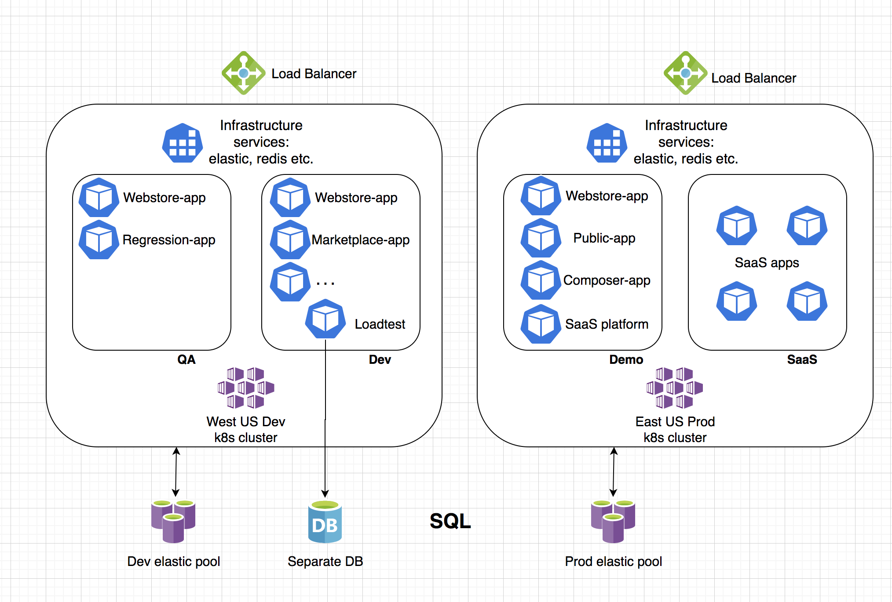

# Virto Commerce Continuous Deployments

This repository contains definition of Virto Commerce CD infrastructure:

- webstore-demo - b2c storefront demo
- b2b-demo - b2b demo
- demo-apps - packages all together, includes namespaces and application definition
- elastic - contains manifest for setting up elasticsearch in the cluster
- terraform-infra - contains templates to setup overall infrastructure in azure including k8s and azure sql server, this is a place to start

## Setup Kubernetes Cluster with ARGO CD

### Step 1 - Terraforming (setup azure infrastructure)
During this step, we'll create a infrastructure needed to configure CD.

1. Download & Configure Terraform on you machine
2. Initialize state, so it is persisted in azure blob storage.
// create storage account
```
az storage container create -n tfstate --account-name <account-name> --account-key <account-key>
```

// init state
```
terraform init -backend-config="storage_account_name=<account-name>" -backend-config="container_name=tfstate" -backend-config="access_key=<access-key>" -backend-config="key=codelab.microsoft.tfstate"
```

3. Create principal, that you'll use to access azure instance.
```
az ad sp create-for-rbac \ --role="Contributor" \ --scopes="/subscriptions/<subscription_id>"
```
4. Run the terraform plan.
```
terraform plan -var="service_principal_client_id=<client_id>" -var="service_principal_client_secret=<client_secret>" -var="db_password=<db_password>" -out out.plan
```
5. Execute the plan
```
terraform apply out.plan
```
6. Add cluster configuration to your .kube\config file (the output from the previous command).

### Step 2 - Setup Argo CD in the K8S
follow guidance from here https://argoproj.github.io/argo-cd/getting_started/

1. Install Argo CD (non declarativa way).
```
kubectl create namespace argocd
kubectl apply -n argocd -f https://raw.githubusercontent.com/argoproj/argo-cd/stable/manifests/install.yaml
```

2. Download latest argocd CLI

https://github.com/argoproj/argo-cd/releases/latest

3. Expose ARGO CD public ip
```
kubectl patch svc argocd-server -n argocd -p "{\"spec\": {\"type\": \"LoadBalancer\"}}"
```

4. Get and change password for ARGO CD (the part after pod/ is a password for user admin)
```
kubectl get pods -n argocd -l app.kubernetes.io/name=argocd-server -o name`
argocd login <ARGOCD_SERVER>
argocd account update-password
```

You can get argocd server IP by browsing your k8s:
```
az aks browse --resource-group <resource-group> --name <cluster-name>
```

### Step 3 - Configure apps in Argo CD

1. Setup secrets

For each namespace, add db password secret used in the earlier step with terraform
```
kubectl create namespace development
kubectl create secret generic vc-dbserver-password --from-literal=password=<db_password> -n development
```

2. Install Apps of Apps
```
argocd app create demo-apps --dest-namespace demo --dest-server https://kubernetes.default.svc --repo https://github.com/virtocommerce/vc-deploy-infra.git --path demo-apps
```


## Infrastructure map

